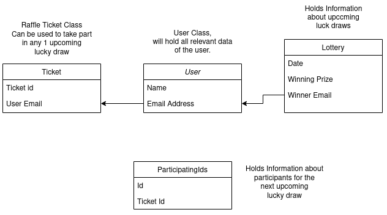

# Lucky Draw REST APIs

The following APIs are made using Flask, and data is stored in an sqlite database.
There is a minimal ui that has all the required elements (form, result display).

## Features
- Register a user into the system 
- Generate Raffle Tickets for a user, that can be used for 1 upcoming lucky draw.
- Get Upcoming Lucky Draw details.
- User can participate in the next upcoming luck draw.
- Get past winners.
- Single url to draw the upcoming lucky-draw.

## Developer Setup
- Install the dependencies listed in requirements.txt
    ```sh
      pip install -r requirements.txt
    ```
- In the repository main folder, you will need to create the first run database manually. Just fire a python3 REPL inside and folder and run the following commands.
    ```sh
      $ python3
      from grofers import db
      db.create_all()
    ```
    This will create a grofers.sqlite file inside the repo where all data will be stored.
- Run the flask app
    ```sh
      export FLASK_APP=run
      flask run
    ```


# API documentation
## Entities: 


##### "/register-user" : 
In the example provided with the assignment pdf, these APIs were to be consumed by verified users, so I skipped the redundant user-verification chore, and made a minimal user-registeration page that takes parameters "Name" and "Email".  This name will be used as the identifier at all places inside the app. 

##### "/get-ticket" : 
This api takes in a email as a form parameter, and generates a unique raffle ticket number. This ticket is also stored in database, and can be used in any future lucky draw.

##### "/" : 
Lists the upcoming lotteries, along with the dates, and prizes.

##### "/participate-in-lottery" : 
This api takes in "Email" as the only Parameter. The server then first checks whether this email is registered or not. It then proceeds to check whether this user has any raffle tickets, or not. If he has a raffle ticket, the oldest raffle ticket is used to participate in the nearest upcoming lucky draw. The server puts this ticketId inside the participatingIds table, if his email is not already there. This completes the registration process.

##### "/get-winners": 
Lists a table of previos past 7 winner emails, along the date they won, and the prize the grabbed by the lucky draw.

##### "/open-lucky-draw":
The single url, which does the job of drawing out the lottery. A cron job can be scheduled in the server machine to automatically trigger this api, at the appointed draw time of the lottery. On the hind-sight, it picks a random ticket id from the list of participating ids, and the email associated with this ticket is marked as the winner.
After the draw is over, the server drops the participating tickets table, thereby also deleting all the used tickets. The results can be view on the results page.

##### "/dummy":
An endpoint to create dummy data into the system for testing purposes. After hitting this endpoint once, you can head straight to the open-lucky-draw end point to run a demo lucky draw. 

##### "/reset":
An endpoint to delete all the data within the lucky draw database. 

Made by [Mohit Raj Munot](https://github.com/mrm1999/)
